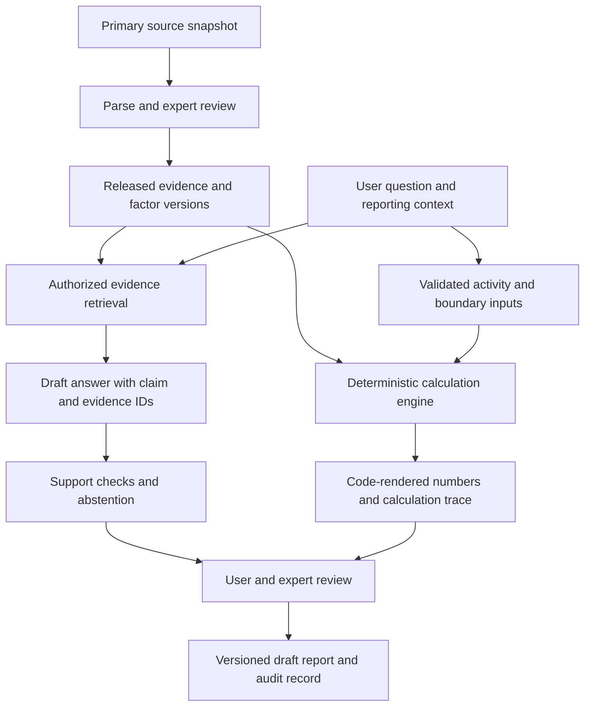

# Neuvetra: evidence and deterministic GHG accounting architecture

Research proposal, 8 September 2026. This document describes a proposed first milestone and later release gates; it does not certify existing software, source data, calculations, or legal compliance. No production systems or secrets were inspected for this assessment.

Neuvetra is the single product and company direction: a California/U.S. GHG research assistant with separately controlled, deterministic accounting. FrontDesk is deferred; the TerraScope brand is retired. Historical directory names below identify inherited material, not a proposed second product. The user's current direction supersedes historical multi-product plans and EU expansion ambitions.

The first deliverable should prove two things on a small, reviewed sample: an answer can show the exact evidence supporting it, and an emissions result can be reproduced from its recorded inputs and approved methodology. It should also demonstrate useful abstention. Neither retrieval nor model prompting can promise zero hallucinations. NIST identifies confabulation as a generative AI risk requiring evaluation and risk management. [NIST Generative AI Profile](https://nvlpubs.nist.gov/nistpubs/ai/NIST.AI.600-1.pdf)

## What the inherited material establishes

Notes were read before their associated code: the root and product guidance, memory index, historical product and launch notes, calculator specifications, GHG knowledge-base instructions, then the legacy retrieval project's README and PROJECT notes. They establish intent, not implementation or correctness. Counts, readiness labels, inferred claims, regulations, and factors require independent verification.

| Material | Evidence and limitation | Proposed treatment |
|---|---|---|
| Product plans | [Historical product note](../../claude-memory/products/terrascope.md) and [phase 1–3 PRD](../terrascope/prd-terrascope-phase1-3.md) describe chat, inventories, uploads, reports, and subscriptions. Factor counts and canonical calculator language differ across notes. | Keep as discovery material. Rewrite scope around one Neuvetra demo; do not import old deadlines or launch promises into answers. |
| Source/claim provenance | [Provenance decision](../../claude-memory/decisions/2026-04-28-ghg-kb-confidence-provenance.md), line 65, assigns extracted claims implicit confidence 1.0. [GHG KB guidance](../../ghg-kb/CLAUDE.md) separates raw evidence, wiki interpretation, factors, and code. | Reuse the separation and source locators. Replace confidence percentages with review status and provenance type. Extraction does not establish truth or applicability. |
| Python calculator | [Base types](../../ghg-kb/calculations/base.py), lines 63 and 81, store factor/result values as floats. [Resolver](../../ghg-kb/calculations/factor_resolver.py), lines 97–106 and 193, selects the latest effective start among candidates and converts source values to floats. Four method modules exist. | Reuse method decomposition, unit validation ideas, and fixtures as candidates. Rebuild the numerical core and selection contract; independently verify every method and expected result. |
| Inventory aggregation | [Inventory](../../ghg-kb/calculations/inventory.py), lines 142–186, warns about regime mismatch or unusual boundary multipliers but still appends entries. It separates location-based and market-based Scope 2 buckets. | Retain distinct Scope 2 views. Replace permissive aggregation with explicit validation and export-blocking decisions. |
| Factor schema | [SQL schema](../../ghg-kb/factors/schema.sql) has numeric values, sources, dates, gas/GWP metadata, and unit classes, but uses one `factor_id` primary key alongside version fields. | Reuse useful columns. Introduce stable identity plus immutable version identity and release records. A checked-in schema does not prove deployed contents or reviewed data. |
| Legacy GHG application | [Calculator package](../../packages/terrascope-calculator/src/index.ts), line 6, throws a stub error. The [chat route](../../apps/terrascope-api/src/routes/chat.ts), lines 61–64, asks a model to divide and round the result; line 176 separately performs display arithmetic. | Quarantine the route as a prototype. Build one typed calculation contract and deterministic result renderer. A successful build is not evidence of a usable accounting service. |
| Existing Neuvetra shell | [Site API authentication helper](../../apps/site-api/src/lib/auth.ts), [chat route](../../apps/site-api/src/routes/chat.ts), and frontend provide patterns for session checks, bounded input, dependency injection, error handling, and chat UI. The [KB loader](../../apps/site-api/src/lib/kb-corpus.ts) injects brand content and permits general-knowledge fallback when empty. | Reuse shell and test patterns after checking current behavior. Replace brand prompt content with the evidence service. Optional identity on public chat is not tenant authorization. |
| Existing QA tests | [Calculator harness](../../ghg-kb/calculations/tests/test_harness.py) checks discovered specifications and tolerances. Legacy RAG QA tests mostly use mocked documents and model output. | Retain mechanics, but do not treat AI-authored expected values or mocked citation formatting as independent correctness evidence. |

### Additional findings from `rag-pipeline`

The separately cloned repository at `C:/Users/nimab/Neuvetra/rag-pipeline` was reviewed at commit `2adfaca51fae3681ea030bbdefc60e1e6edcec82`. Its README calls it production-ready; that claim is unverified. The local manifest contains one Corporate Standard record, marked `is_latest: false`. Neither that flag nor the many other dataset files establishes the contents, coverage, or currency of a live index. [Manifest](C:/Users/nimab/Neuvetra/rag-pipeline/doc_manifest.json)

Useful pieces are the document metadata model, source-card formatting, chunk packaging, adapter separation, no-context fallback, and mocked test structure. The following are reasons to rebuild the QA boundary before connecting private customer data:

- **Citation existence is checked more narrowly than citation support.** The parser removes out-of-range numbers from the `citations` array but returns the answer prose unchanged. It does not check that each claim is supported by its passage, or that inline citations match the array. The test named hallucination detection checks only removal of citation 99. [Parser, line 92](C:/Users/nimab/Neuvetra/rag-pipeline/rag_core/prompting/output_schema.py:92), [test, line 96](C:/Users/nimab/Neuvetra/rag-pipeline/tests/test_qa_chain.py:96)
- **Trimming can leave accepted but unresolved citations.** The chain passes the pre-trimming document count as the maximum citation number. The context packer removes trailing entries from its map; source resolution silently skips absent numbers. Validate against the actual selected evidence IDs, not the earlier count. [Chain, line 133](C:/Users/nimab/Neuvetra/rag-pipeline/rag_core/service/qa_chain.py:133), [packer, line 155](C:/Users/nimab/Neuvetra/rag-pipeline/rag_core/retrieval/context_pack.py:155), [resolver, line 344](C:/Users/nimab/Neuvetra/rag-pipeline/rag_core/retrieval/context_pack.py:344)
- **There is no tenant security contract.** `/qa` accepts a caller-provided metadata filter and calls a process-global chain without identity or membership checks. The normal retriever mutates shared search options only when a filter is supplied. Its compressed wrapper does not define the `search_kwargs` field that the filter path accesses; filtered behavior needs a focused runtime test. None of these mechanisms establishes isolation. [API, lines 83 and 153](C:/Users/nimab/Neuvetra/rag-pipeline/rag_core/service/api.py:153), [retriever, line 885](C:/Users/nimab/Neuvetra/rag-pipeline/rag_core/retrieval/retriever.py:885), [wrapper, line 515](C:/Users/nimab/Neuvetra/rag-pipeline/rag_core/retrieval/retriever.py:515)
- **Recall fallbacks are not authority checks.** Optional waterfall retrieval relaxes similarity requirements and can search a global namespace. The global fallback is disabled by default, and the chain defaults to the older retrieval path. Do not turn fallback into a route around approval, date, jurisdiction, or tenant constraints. [Waterfall, line 644](C:/Users/nimab/Neuvetra/rag-pipeline/rag_core/retrieval/retriever.py:644), [global store, line 810](C:/Users/nimab/Neuvetra/rag-pipeline/rag_core/retrieval/retriever.py:810), [default, line 133](C:/Users/nimab/Neuvetra/rag-pipeline/rag_core/config.py:133)
- **Retrieved text can influence instructions.** Context and question are concatenated into one user message; grounding and date handling rely on prompts. The QA call supplies no execution tools, so this inspection establishes answer-integrity risk, not arbitrary code execution. A future tool-enabled assistant would require stronger authorization boundaries. [Prompt, line 64](C:/Users/nimab/Neuvetra/rag-pipeline/rag_core/prompting/prompts.py:64), [model call, line 186](C:/Users/nimab/Neuvetra/rag-pipeline/rag_core/service/qa_chain.py:186)
- **Logging and failure output need privacy work.** The API and chain log the first 100 question characters; multiple exception paths return exception text to the user. Secret-pattern redaction is not customer-data minimization. [API, line 173](C:/Users/nimab/Neuvetra/rag-pipeline/rag_core/service/api.py:173), [chain, lines 95 and 149](C:/Users/nimab/Neuvetra/rag-pipeline/rag_core/service/qa_chain.py:95)

This was a source inspection. No external index was queried, tests were not rerun for this document, and deployment configuration was not audited here.

## Proposed system boundary

Use one Neuvetra interface and a small orchestration API. Keep evidence answering and accounting as separate services/contracts, even if the first demo runs them on one machine. A model may classify a question or propose structured inputs; application code authorizes operations, validates inputs, selects approved methods, and renders numerical results.

Proposed authoritative stores are PostgreSQL for structured versions, permissions, and records, and object storage for immutable source/upload snapshots. Search indexes are replaceable derived data. Start with a small approved corpus and a lexical/metadata baseline; compare hybrid retrieval and existing Pinecone/Weaviate adapters using the same evaluation set before selecting infrastructure. A knowledge graph is optional if evaluation shows a concrete benefit for cross-source relationships.

For the demo, use one canonical Python calculation implementation with `Decimal` and a strict JSON contract to the Bun API. This is a proposal, not an inherited language decision: Python preserves useful method work and supports explicit numerical contexts. A future TypeScript implementation should replace that authority only after independently verified parity. Do not maintain two competing sources of accounting truth.

## Evidence and source lifecycle

Every source starts `unreviewed`, then moves through `parsed`, `reviewed`, and `released`, with later `superseded` or `withdrawn` states. Reviewers approve a specific content hash and intended use. AI-generated summaries, wiki claims, extracted tables, inherited factors, and unsupported third-party articles remain outside the answer/calculation release until verified against appropriate primary evidence.

Record canonical URL, publisher, retrieval time, publication date, effective interval when applicable, jurisdiction, document type, edition, content hash, parser version, rights/access terms, and reviewer decision. Publication year, emissions data year, factor release year, and legal effective date are different fields. `is_latest` alone cannot represent them. A source may remain appropriate for an earlier reporting period after a newer edition appears.

Preserve original bytes subject to approved rights and retention rules. For each evidence span, store source-version ID, page index and printed page label where different, section/table/row/column, exact text or cell content, and a link to the frozen artifact. OCR-derived numeric cells and footnotes need explicit verification. Store interpretations as separate claims with their derivation type and reviewer, not as replacements for source text.

Source updates create new versions. Existing answers and inventories retain their selected versions. A changed source generates an impact list and an optional reviewed recalculation with a difference report; it must not silently rewrite an approved inventory. A source-refresh owner and a last-checked/freshness policy are required for time-sensitive answers.

The provenance model can remain ordinary relational tables: source and result entities, extraction and calculation activities, and responsible human/software agents. This follows the useful distinctions in W3C PROV without requiring a graph database or an RDF implementation. [W3C PROV-DM](https://www.w3.org/TR/prov-dm/)

## Answer contract and abstention

Each request carries the question, intended jurisdiction, relevant date/reporting period, framework when known, and permitted corpus release. Ask for missing facts when they materially change the answer. Do not infer a company's legal applicability from its name, an incomplete revenue estimate, or an unsupported model assertion.

Retrieval must enforce authorization, approved source status, temporal applicability, and scope before evidence enters the model context. Reranking may change relevance order but may not relax these constraints. The system can propose a new source for review when coverage is missing; discovering a URL does not make it authoritative.

The model drafts structured claims referencing only supplied evidence IDs. Application checks reject unknown IDs, broken locators, missing required citations, unsupported numeric slots, and inconsistent source versions. A support-checking model may help triage passage entailment and contradictions, but is not an independent guarantee. Expert review of the evaluation set and consequential output remains necessary.

Return one of a small set of explicit states: `supported`, `qualified`, `needs_input`, `needs_review`, `unsupported`, `stale_or_conflicting`, or `unavailable`. `needs_input` requests missing user facts; `needs_review` withholds a candidate that fails evidence/support checks; `unavailable` reports a technical/provider dependency failure. `unsupported` describes a coverage boundary. A qualified answer states its assumption and relevant limitation next to the claim. An abstention says what is missing and what evidence or user input would resolve it. Retrieval similarity is not a probability of correctness; do not display invented confidence percentages. The [M2 case bank](../../evaluations/research-qa/README.md) uses this same vocabulary.

Treat documents, OCR, user uploads, and search results as untrusted data. Delimit evidence, strip active markup from display, allow only approved source links, and prevent retrieved text from changing permissions or calling tools. Keep extraction and answering separate from administrative capabilities. Any future write operation must use server-validated intent and scoped credentials. Test malicious instructions hidden in footnotes, table cells, source metadata, and customer files. OWASP specifically warns that indirect prompt injection can arrive through external material and that RAG does not eliminate it. [OWASP prompt injection guidance](https://genai.owasp.org/llmrisk/llm01-prompt-injection/)

## Deterministic accounting contract

Deterministic means the same validated inputs and versioned policy produce the same numerical payload. It does not mean measured emissions are perfectly known. Preserve uncertainty, estimation status, exclusions, and data-quality limitations separately from arithmetic.

All decimal inputs, factors, intermediate values, and outputs cross JSON boundaries as decimal strings with explicit units. Construct decimal values from strings; never route source values through binary floats. Store decimal values in suitable PostgreSQL `numeric` columns with bounds chosen for the permitted methods. Record arithmetic precision, rounding mode, rounding points, and conversion version. Exact finite decimal operations and rational unit conversions should remain exact when possible; recurring division requires an explicit precision/rounding policy. Python Decimal supports contexts and signals, but using it alone does not prevent inexact operations or incorrect input construction. [Python Decimal documentation](https://docs.python.org/3/library/decimal.html)

Use an approved method registry, not dynamic function names supplied by documents or the model. A method defines required inputs, allowed units, formula/version, gas treatment, eligible factor classes, allowed boundaries, validation errors, and output schema. Method changes require new versions and independent expected results.

Factor selection must be explicit and reproducible: substance/fuel, numerator and denominator units, gas mass versus already-converted CO2e, GWP source/version/time horizon where applicable, heat basis, geography/subregion, activity period, factor release, applicability interval, and method eligibility. The selected factor-version ID is pinned before calculation. No hidden latest-factor selection, geography substitution, assumed heat content, or double application of GWP is allowed. If a method permits estimation or a fallback, record its approved policy and user/reviewer decision.

Boundary and period inputs include organizational consolidation approach, entities/facilities/assets in scope, reporting dates, allocation evidence, ownership/control policy, and accepted exclusions. A generic multiplier is insufficient to establish the right treatment. Split activity periods where required by the approved policy, and block unresolved mixed regimes or incompatible units. Detect duplicate activity through document and activity identifiers; two valid activities may legitimately use the same factor.

Keep gas-level results and separate Scope 2 location-based and market-based views. Never add those alternative views together as if they were distinct emissions. Reports identify the chosen total view and distinguish missing data from zero. Domain reviewers must approve the implementation of these treatments for each supported method.

The engine returns result values, units, input snapshot IDs, factor and source versions, method version, conversion steps, rounding policy, warnings/errors, and a deterministic payload hash. Code renders every calculated number, conversion, subtotal, total, and percentage. The language model may explain locked result fields; it cannot recalculate or freely rewrite them. Export files use the same payload.

## Minimum record model

| Record | Required relationship or invariant |
|---|---|
| `source_version`, `evidence_span`, `claim_review` | Immutable content hash and locators; review ties to the exact version and allowed purpose. |
| `factor`, `factor_version`, `factor_release` | Stable factor identity separate from immutable value/version; typed units and applicability; approved source span. |
| `method_version`, `conversion_version` | Approved implementation and policy hash; supported input/factor schemas and independent fixtures. |
| `tenant`, `membership`, `facility`, `boundary_version` | Server-verified membership; versioned reporting boundary with explicit reviewer decisions. |
| `upload_version`, `extraction_draft`, `activity_version` | Original evidence retained; corrected extraction is a new version; approved activity references its source field. |
| `calculation_run`, `inventory_version`, `report_version` | Pinned inputs and factors; immutable result payload; amendments supersede instead of overwrite. |
| `answer_run`, `review_decision`, `audit_event` | Selected evidence, model/prompt/index versions, output state, actor, and decision; approval invalidates when its reviewed payload changes. |

Every private record carries its tenant scope; public primary evidence has a separate, explicit visibility class. Foreign-key relationships must prevent references across tenants even when individual record IDs are valid.

## Data ingestion and tenant isolation

The first demo should use synthetic activities and reviewed public sources. Customer upload support comes after isolation and retention controls are demonstrated. Ingestion must retain the original file, validate actual file type and limits, scan/sandbox processing, and avoid executing macros, spreadsheet formulas, embedded scripts, or external links. OCR and model extraction produce drafts with field-level evidence spans. Users or reviewers confirm quantities, units, dates, facility identity, credits, and duplicate handling before accounting.

Use one shared identity system if retained from the current platform, but authorize each request against current server-side tenant membership. Never trust a submitted tenant ID or metadata filter alone. Private endpoints reject missing or invalid identity rather than falling back to anonymous access. Public research chat can be anonymous only against released public evidence, with bounded spend.

Version-control row-level policies for reads and writes, including ownership changes and background jobs. Runtime database roles must not own protected tables or have `BYPASSRLS`; apply transaction-local tenant context safely when using pooled connections. PostgreSQL enables default-deny behavior when row security is enabled without an applicable policy, but owners and privileged roles can bypass it unless configured appropriately. Database settings and application tests are both necessary. [PostgreSQL row security documentation](https://www.postgresql.org/docs/current/ddl-rowsecurity.html)

Enforce the same identity scope in object storage, vector retrieval, queues, caches, report download URLs, search results, and observability tools. Private retrieval must never fall back to another tenant or a global mixed namespace. Public sources and authorized private evidence may be combined only through an explicit server policy. Test membership revocation, guessed IDs, stale caches, signed-link expiry, retries, and concurrent requests from different tenants.

Give workers only the access needed for their job; bind tenant and source versions when enqueuing and validate them again when executing. Restrict administrative access, record exceptional access, and separate production from demo fixtures. Keep customer material out of model training or broad logs by default, subject to explicit vendor and customer agreements. Redact/minimize prompts and traces before enabling detailed telemetry.

## Audit, review, and product decisions

An audit record should explain what happened without storing hidden model reasoning: record actor, request ID, selected evidence and factors, tool arguments/results, model and prompt version, index release, validation outcomes, and concise user-visible rationale. Record timestamps separately from the deterministic calculation payload so replay equality is well-defined. Hashes detect changed content; they do not replace access controls, retention enforcement, backups, or independent review.

Human approval binds to an exact report/inventory fingerprint. Any material change to evidence, activity, factor, method, boundary, or result invalidates that approval. Make correction, supersession, and comparison ordinary product workflows. A reviewer should be able to navigate from a total to each activity, factor cell, original source, and recorded decision.

The following are proposed business decisions before a paid pilot, not assertions of legal requirements:

- Position outputs as research assistance and draft accounting workpapers until an appropriately qualified reviewer accepts them. Do not advertise guaranteed compliance, legal advice, audit assurance, or regulator acceptance.
- Fund named GHG expertise for methodology/source review and a review queue. Determine which outputs require review and who may approve them. Keep automated filing or regulatory submission outside the initial scope.
- Have counsel review terms, claims, liability allocation, customer responsibilities, privacy/data-processing terms, retention/deletion, source rights, and the professional-service model. Assess insurance and incident/correction procedures against the actual service offered.
- Track model, ingestion, storage, and expert-review costs per run. Rate-limit anonymous use and cap expensive operations. Subscription entitlements and usage ledgers are separate from accounting results.
- Defer paid billing until service scope is defined. Later billing needs verified, idempotent processor events, auditable entitlements, failure handling, and a user-visible price/usage agreement. The historical subscription ambition is not evidence that those controls exist.

## Staged demonstrations and acceptance gates

All targets below are proposed release criteria. They are not achieved results, statistical guarantees, or a launch date. Freeze the evaluation set and rubric before tuning; retain a held-out set and report denominators, failures, and abstentions. A model-only judge cannot approve the reference truth.

| Stage | Demonstration | Measurable gate before proceeding |
|---|---|---|
| 0. Research contract | A small California/U.S. source inventory, explicit in/out scope, sample evidence records, calculation contract, and independently reviewed examples. | Every released source/factor has an owner, version/hash, primary locator, applicability decision, and rights review. Resolve canonical methodology and reporting assumptions for the first two methods. Unreviewed material is visibly excluded. |
| 1. Evidence answers | Questions answered from a frozen corpus with clickable passage evidence; unsupported and stale questions demonstrated. | Start with at least 100 expert-labeled cases: 60 supported, 20 unsupported, 20 temporal/conflict cases. Require 100% citation ID/locator resolution, at least 98% supported material claims in the reviewed output sample, at least 95% correct abstention/qualification on negative cases, and at least 80% useful answers on supported cases. No observed critical misstatement of applicability, boundary, or reporting obligation is allowed. |
| 2. Exact calculation | Stationary combustion and location-based purchased electricity, limited to explicitly approved fuels/regions/periods, using confirmed synthetic activity. | All independent golden cases pass the specified numerical/rounding policy; canonical replay payloads match exactly. Cover unit equivalence, zero, invalid/negative inputs by policy, missing/ambiguous factors, period boundaries, mixed regimes, duplicate activity, rounding ties, and GWP misuse. Every displayed/exported number resolves to a result field. |
| 3. Reviewed evidence-to-report | Synthetic bills and structured files become field-linked extraction drafts, confirmed activities, calculations, and a draft report. | All critical numeric/unit/date fields are verified before use; rejected or unknown fields cannot silently default. Repeated imports do not double-count activity. Each report total reconciles to the ledger, and a reviewer can trace it to original evidence. Changing an approved input invalidates approval and produces a comparison. |
| 4. Tenant sandbox | Two independent sample organizations run uploads, retrieval, calculations, jobs, and exports. | Zero unauthorized results in the explicit cross-tenant test matrix for every data surface; positive authorized cases also pass. Include revoked membership, concurrent requests, stale cache, queue replay, guessed IDs, and signed URLs. Privacy review covers logs and vendor data paths. |
| 5. Limited paid pilot | Named organizations, named reviewer, bounded scope and costs. | All earlier gates pass; source refresh, deletion/retention, incident handling, restore/replay, billing, and reviewer workflows are exercised. Measure latency and per-run cost before setting the service promise. Launch requires an explicit product decision. |

For arithmetic golden cases, published examples with rounded outputs can use a documented comparison tolerance, but that tolerance must not replace independently calculated exact intermediate expectations. Existing broad percentage-tolerance fixtures alone are insufficient. Review numerical edge cases and methodology assumptions separately.

Maintain adversarial suites for prompt injection, misleading citations, absent evidence, conflicting editions, OCR decimal errors, regional factor mismatch, and customer-data isolation. Any model, prompt, parser, source release, factor release, or method change triggers the relevant suites. Show residual failures and uncertainty; do not convert finite test success into a zero-hallucination claim.

## Highest-value first coding milestone

After the reviewed source/method sample is ready, build one vertical demonstration: ask a supported GHG question and inspect its exact source span; then enter a confirmed activity and inspect the deterministic calculation trace. Include an unsupported question, an ambiguous factor selection, and a source-version change so failure and amendment behavior are visible from the beginning.

The coding slice should contain an evidence/source-version schema, a strict answer/result contract, one approved method implemented with decimal arithmetic, a deterministic source/result renderer, and offline fixtures. Reuse the Neuvetra shell. Keep inherited RAG and calculator implementations as comparison material until their relevant behavior passes the new contracts.

Open product choices are the first customer persona, the exact initial accounting scope and jurisdiction questions, named expert reviewer, source-access rights, method/GWP policy, supported data periods, and acceptable review turnaround. The current research should resolve these narrowly enough to demonstrate trustworthy behavior before adding ingestion breadth, advanced retrieval infrastructure, paid billing, or more calculation methods.
